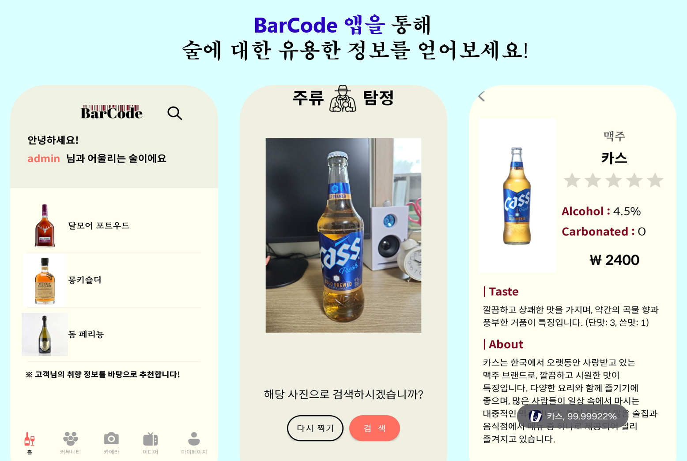
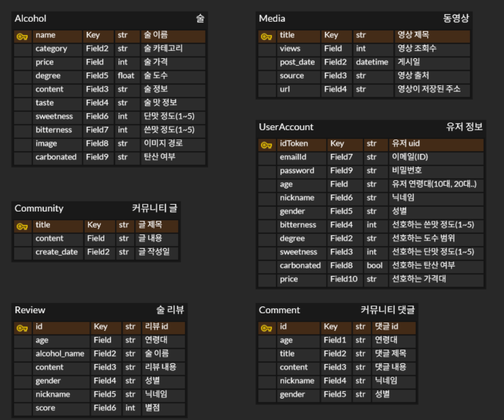

# 🍶 Barcode - 주류와 더 친해질 수 있는 앱
AI 기반 주류 추천 및 정보 전달 어플리케이션 (2024.03.07 ~ 2024.06.20)   

## 💻Intro

**“BarCode”** 는 술에 대한 정보가 부족하거나 다가가기 어려웠던 분들을 대상으로 만든 술 추천 어플리케이션입니다. 😀😀  
이 앱은 술 정보 전달 외에도 사용자 취향 기반 술 추천, AI 카메라 촬영을 통한 이미지 검색 등을 지원합니다.   

## ⚙️개발 환경 및 기술스택

### Database & Server

### IDE

### Collaborations

### UI

### AI
   

## 🏢ERD(Entity Relationship Diagram)

- **Alcohol** : 술 테이블
- **Media** : 동영상 테이블
- **Community** : 커뮤니티 글 테이블
- **UserAccount** : 유저 테이블
- **Review** : 술 리뷰 테이블
- **Comment** : 커뮤니티 댓글 테이블
  

## 📱주요 기능
1. **주류 검색 기능**
   - 카테고리별 검색
   - 키워드 검색
   - AI 카메라로 이미지 검색 
  
2. **주류 추천 기능**
   - 홈화면에 사용자 취향 기반으로 술 추천
  
3. **커뮤니티 기능**
   - 커뮤니티 글에 댓글 달기
   - 주류 상세화면에 리뷰 달기 

4. **계정 관련 기능**
   - 회원가입
   - 로그인
   - 취향정보/비밀번호 변경
   - 회원탈퇴
  

## 📱실행화면

